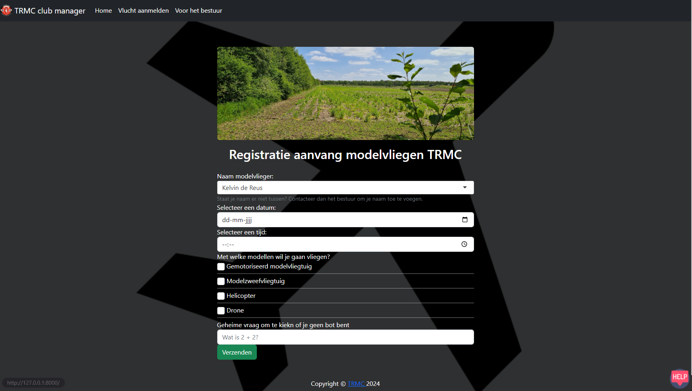
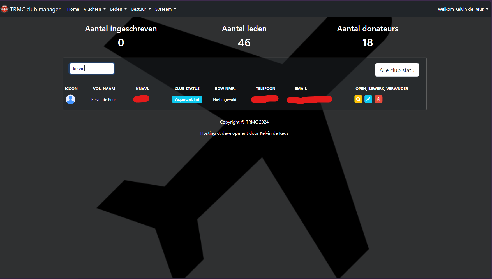
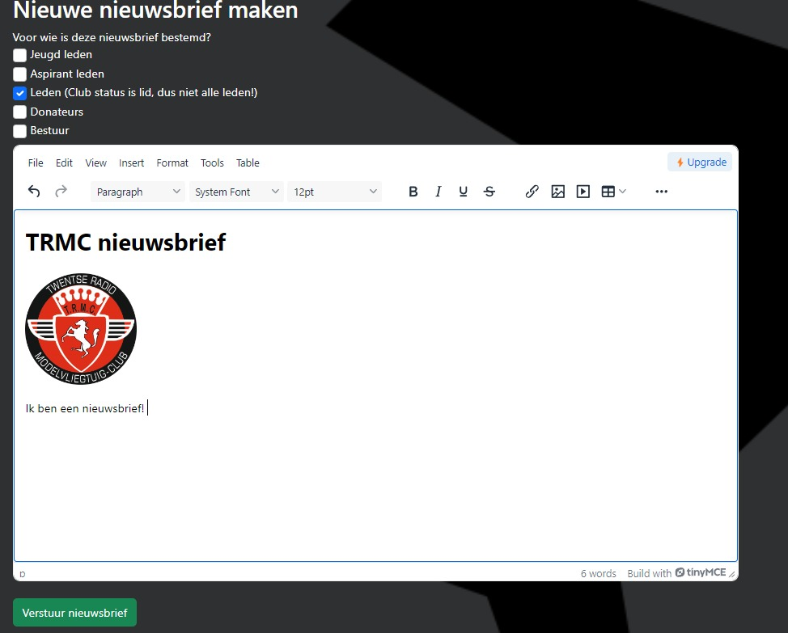

[![Issues][issues-shield]][issues-url]
[![MIT License][license-shield]][license-url]

<!-- Club logo -->
 

  

  <h3 align="center">RC Plane Club Manager</h3>
  

    A custom solution build for RC plane clubs... Read below more.
     
    <a href="#">Explore the docs!</a>
  

<!-- table of contents -->

  
Table of Contents

  <ol>
    <li>
      <a href="#about-the-project">About the project</a>
      <ul>
        <li><a href="#why-was-this-build">Why was this build?</a></li>
        <li><a href="#tech-stack">Tech stack</a></li>
        <li><a href="#screenshots">Screenshots</a></li>
      </ul>
    </li>
    <li>
      <a href="#features">Features</a>
      <ul>
        <li><a href="#member-features">For club members</a></li>
        <li><a href="#management-features">For management</a></li>
        <li><a href="#automatisations">Automatisations</a></li>
        <li><a href="#other-features">Other features</a></li>
      </ul>
    </li>
    <li>
      <a href="#getting-started">Getting Started</a>
      <ul>
        <li><a href="#installation">Installation</a></li>
        <li><a href="#make-default-user">Creating default user</a></li>
      </ul>
    </li>
    <li><a href="#usage">Usage</a></li>
    <li><a href="#roadmap">Roadmap</a></li>
    <li><a href="#license">License</a></li>
    <li><a href="#wanna-support-my-work-please-buy-me-a-beer">Support</a></li>
  </ol>

  
<!-- about the project -->
## About the project
### Why was this build?
An custom solution initially build for [TRMC](https://trmc.nl). It allows for club members to register their flights easily before taking flight on the club field. Management from TRMC can then view the flights, export them for them for the local authority, send newsletters to members and even more...

(<a href="#readme-top">back to top</a>)

<!-- built with -->
### Tech stack
How this project was built:

* [![Laravel][Laravel.com]][Laravel-url]
* [![Bootstrap][Bootstrap.com]][Bootstrap-url]
* [![MySQL][MySQL.com]][MySQL.com]
* ![PHP-shield]

(<a href="#readme-top">back to top</a>)

<!-- Screenshots -->
### Screenshots

  

  

  

(<a href="#readme-top">back to top</a>)

<!-- features -->
## Features
### Member features
- Register an new flight.

### Management features
- View all flights.
- Export flights.
- Add members.
- Edit members.
- Delete members
- Add management people.
- View logs (Laravel, access, edit and Fail2Ban logs).
- Unban Fail2Ban IP.
- Send newsletter to specific club members (like junior member, member etc).
- Edit own profile.
- Manage brevets/certificates for members.
- Probs forgot something xD.

### Automations
- Sends an email to an member when his club status changes.
- Fail2Ban cleans IP bans olden then x minutes.

### Other
- Members sync to Wordpress.
- Logging.
- Fail2Ban.

(<a href="#readme-top">back to top</a>)

<!-- getting started -->
## Getting Started
### Installation
This installation guide isn't very complete yet. 
- Clone the repository in your'e webhosting folder (like `public_html`).
- copy `.env.example` to `.env`.
- Fill in all the database credentials.
- Run `composer install` in the website root directory.
- Run `php artisan key:generate` 

### Make the default user
- Run: `php artisan db:seed`.
- Go to `www.<youre-url>/authenticatie-login`.
- Fill in the following credentials: `Admin`, `Admin`.

(<a href="#readme-top">back to top</a>)

<!-- usage -->
## Usage
t.b.c

<!-- roadmap -->
## Roadmap
- [ ] Incident reporting/management
- [ ] Multi language support
- [ ] Installation page

(<a href="#readme-top">back to top</a>)

<!-- license -->
## License
Distributed under the MIT License. See `LICENSE.txt` for more information.

(<a href="#readme-top">back to top</a>)

<!-- Support -->
## Wanna support my work? Please buy me a beer ❤️

(<a href="#readme-top">back to top</a>)

<!-- MARKDOWN LINKS & IMAGES -->
[contributors-shield]: https://img.shields.io/github/contributors/othneildrew/Best-README-Template.svg?style=for-the-badge
[contributors-url]: https://github.com/othneildrew/Best-README-Template/graphs/contributors
[forks-shield]: https://img.shields.io/github/forks/othneildrew/Best-README-Template.svg?style=for-the-badge
[forks-url]: https://github.com/othneildrew/Best-README-Template/network/members
[stars-shield]: https://img.shields.io/github/stars/othneildrew/Best-README-Template.svg?style=for-the-badge
[stars-url]: https://github.com/othneildrew/Best-README-Template/stargazers
[issues-shield]: https://img.shields.io/github/issues/othneildrew/Best-README-Template.svg?style=for-the-badge
[issues-url]: https://github.com/othneildrew/Best-README-Template/issues
[license-shield]: https://img.shields.io/github/license/othneildrew/Best-README-Template.svg?style=for-the-badge
[license-url]: https://github.com/othneildrew/Best-README-Template/blob/master/LICENSE.txt
[Laravel.com]: https://img.shields.io/badge/Laravel-FF2D20?style=for-the-badge&logo=laravel&logoColor=white
[Laravel-url]: https://laravel.com
[Bootstrap.com]: https://img.shields.io/badge/Bootstrap-563D7C?style=for-the-badge&logo=bootstrap&logoColor=white
[Bootstrap-url]: https://getbootstrap.com
[JQuery.com]: https://img.shields.io/badge/jQuery-0769AD?style=for-the-badge&logo=jquery&logoColor=white
[JQuery-url]: https://jquery.com 
[MySQL.com]: https://img.shields.io/badge/MySQL-00000F?style=for-the-badge&logo=mysql&logoColor=white
[MySQL-url]: https://www.mysql.com/
[PHP-shield]: https://img.shields.io/badge/PHP-8.2%2B-yellow