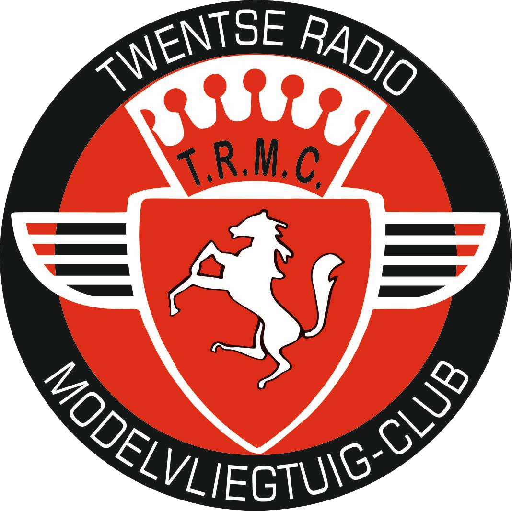

[![Issues][issues-shield]][issues-url]
[![MIT License][license-shield]][license-url]

<!-- Club logo -->
 

  

  <h3 align="center">RC Plane Club Manager</h3>
  

    A custom solution to manage fligts, members and more for RC plane clubs.
     
    <a href="#">Explore the docs</a>
  

<!-- table of contents -->

  
Table of Contents

  <ol>
    <li>
      <a href="#about-the-project">About The Project</a>
      <ul>
        <li><a href="#built-with">Built With</a></li>
      </ul>
    </li>
    <li>
      <a href="#features">Features</a>
      <ul>
        <li><a href="#member-features">Members</a></li>
        <li><a href="#management-features">Management</a></li>
        <li><a href="#other-features">Other</a></li>
      </ul>
    </li>
    <li>
      <a href="#getting-started">Getting Started</a>
      <ul>
        <li><a href="#installation">Installation</a></li>
      </ul>
    </li>
    <li><a href="#usage">Usage</a></li>
    <li><a href="#roadmap">Roadmap</a></li>
    <li><a href="#license">License</a></li>
    <li><a href="#wanna-support-my-work-please-buy-me-a-beer">Support</a></li>
  </ol>

  

<!-- about the project -->
## About the project

An custom solution build for [TRMC](https://trmc.nl). It allows for club members to register their flights easily before taking flight on the club field. Management from TRMC can then view the flights, export them for them for the local authority and more.

  

  

(<a href="#readme-top">back to top</a>)

<!-- built with -->
## Built With
How this project was built:

* [![Laravel][Laravel.com]][Laravel-url]
* [![Bootstrap][Bootstrap.com]][Bootstrap-url]
* [![JQuery][JQuery.com]][JQuery-url]
* [![MySQL][MySQL.com]][MySQL.com]

(<a href="#readme-top">back to top</a>)

<!-- features -->
## Features
### Member features
- Register a new flight.

### Management features
- View all flights.
- Export flights.
- Add members.
- Edit members.
- Delete members
- Add management people.

### Other
- Member certification options.
- Automatic member mailing.
- Members sync to Wordpress.
- Logging.

(<a href="#readme-top">back to top</a>)

<!-- getting started -->
## Getting Started
### Installation
T.b.c

<!-- usage -->
## Usage
t.b.c

<!-- roadmap -->
## Roadmap
- [ ] Incident reporting/management
- [ ] Multi language support
- [ ] Installation page

(<a href="#readme-top">back to top</a>)

<!-- license -->
## License
Distributed under the MIT License. See `LICENSE.txt` for more information.

(<a href="#readme-top">back to top</a>)

<!-- Support -->
## Wanna support my work? Please buy me a beer ❤️

(<a href="#readme-top">back to top</a>)

<!-- MARKDOWN LINKS & IMAGES -->
[contributors-shield]: https://img.shields.io/github/contributors/othneildrew/Best-README-Template.svg?style=for-the-badge
[contributors-url]: https://github.com/othneildrew/Best-README-Template/graphs/contributors
[forks-shield]: https://img.shields.io/github/forks/othneildrew/Best-README-Template.svg?style=for-the-badge
[forks-url]: https://github.com/othneildrew/Best-README-Template/network/members
[stars-shield]: https://img.shields.io/github/stars/othneildrew/Best-README-Template.svg?style=for-the-badge
[stars-url]: https://github.com/othneildrew/Best-README-Template/stargazers
[issues-shield]: https://img.shields.io/github/issues/othneildrew/Best-README-Template.svg?style=for-the-badge
[issues-url]: https://github.com/othneildrew/Best-README-Template/issues
[license-shield]: https://img.shields.io/github/license/othneildrew/Best-README-Template.svg?style=for-the-badge
[license-url]: https://github.com/othneildrew/Best-README-Template/blob/master/LICENSE.txt
[Laravel.com]: https://img.shields.io/badge/Laravel-FF2D20?style=for-the-badge&logo=laravel&logoColor=white
[Laravel-url]: https://laravel.com
[Bootstrap.com]: https://img.shields.io/badge/Bootstrap-563D7C?style=for-the-badge&logo=bootstrap&logoColor=white
[Bootstrap-url]: https://getbootstrap.com
[JQuery.com]: https://img.shields.io/badge/jQuery-0769AD?style=for-the-badge&logo=jquery&logoColor=white
[JQuery-url]: https://jquery.com 
[MySQL.com]: https://img.shields.io/badge/MySQL-00000F?style=for-the-badge&logo=mysql&logoColor=white
[MySQL-url]: https://www.mysql.com/